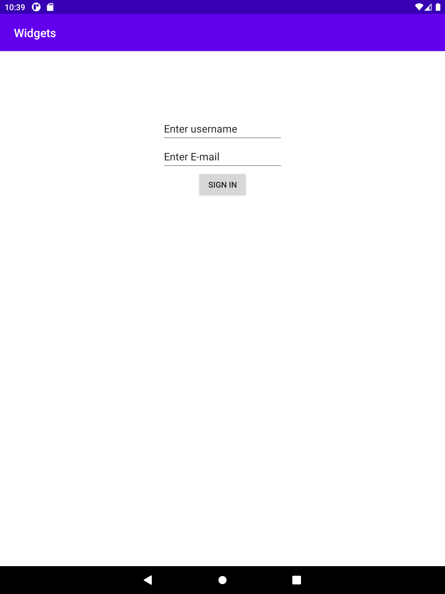

# Rapport

Skapade en layout för en inloggnings sida med en bild och inmatnings fält samt en knapp som användare kan trycka på för att logga in. Knappen ligger under inmattnings fältet genom att
ange "Top_toBottomOf=@+id/card_mail". "Start_toStartOf=parent" och "End_toEndOf=parent" gör att knappen placeras i mitten av skärmen. 
 
```
<EditText
        android:id="@+id/card_mail"
        android:layout_width="wrap_content"
        android:layout_height="wrap_content"
        android:ems="10"
        android:inputType="textPersonName"
        android:minHeight="48dp"
        android:text="Enter E-mail"
        app:layout_constraintEnd_toEndOf="parent"
        app:layout_constraintStart_toStartOf="parent"
        app:layout_constraintTop_toBottomOf="@+id/card_username" 
/>
<Button
        android:id="@+id/card_signin"
        android:layout_width="wrap_content"
        android:layout_height="wrap_content"
        android:text="Sign In"
        app:layout_constraintTop_toBottomOf="@+id/card_mail"
        app:layout_constraintStart_toStartOf="parent"
        app:layout_constraintEnd_toEndOf="parent"
/>
```



